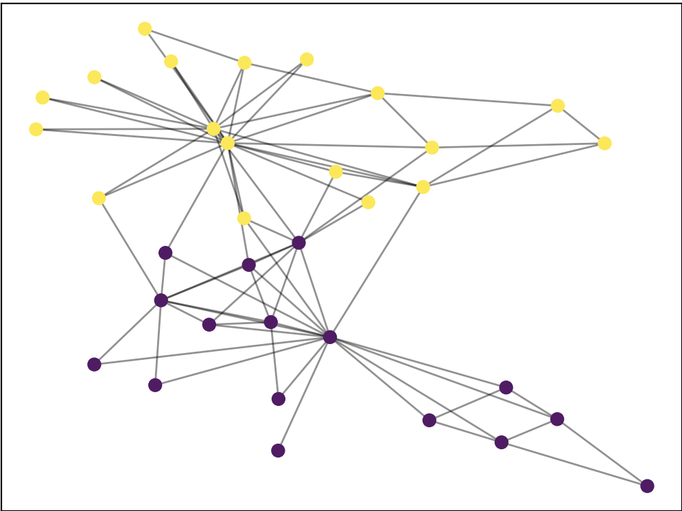

# Polarization and Modularity

Code for modularity and polarization scores as defined in the following [paper](https://www.cs.cornell.edu/home/cardie/papers/ICWSM13-Polarization.pdf)

This paper argues that rather than using modularity as a measure of polarization between two groups or communities (which has previously been used), we define a new measure of polarization using community boundaries.


## Input
Both modularity and polarization objects take an edge list file as input. The edge list file must have the following format:

```
0 1
0 18
1 4
1 8
.
.
.
```

Where each line represents an edge in the graph between nodes i and j. The edge list may be 0-based, or if it is 1-based, will be automatically transferred into 0-based.

A community file is also an optional input. If provided, the community file must abide by the following format:

```
0
0
1
0
2
.
.
.
```

Where the number in each line represents the community and the index of each line represents the node ID (i.e: Node 0 is in community 0, node 4 is in community 2, etc). Again, if the community file is 1-based, it will be converted to 0-based. If a community file is not provided, one will be automatically created using Louvain's algorithm. 

## Output

Both polarization and modularity objects output a 2-d list of scores and community pairs. An example output for the polarization might look like [0.234, (0,2)] representing a polarization score of 0.234 between communities 0 and 2. 

The modularity object also contains an overall modularity score, along with a modularity score for each pair of communities.

## Graphing

You may also plot any graph using both the polarization or modularity object by calling the graphing function as done in the main file with the sample Karate Club data.

